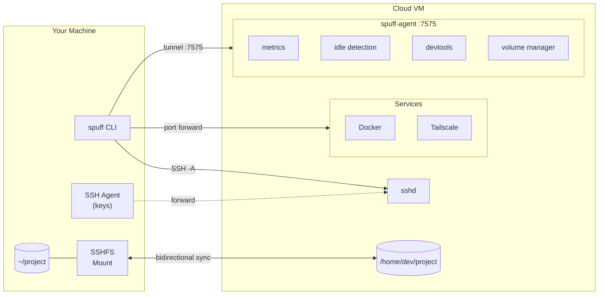

<p align="center">
  <pre align="center">
╔═══════════════════════════╗
║  s p u f f                ║
║  ephemeral dev env        ║
╚═══════════════════════════╝</pre>
</p>

<p align="center">
  <strong>Ephemeral dev environments in the cloud.</strong><br>
  Spin up when needed. Auto-destroy when forgotten.
</p>

<p align="center">
  <a href="#installation">Installation</a> •
  <a href="#quick-start">Quick Start</a> •
  <a href="#features">Features</a> •
  <a href="#configuration">Configuration</a> •
  <a href="#roadmap">Roadmap</a>
</p>

<p align="center">
  
  
  
  
</p>

---

> **⚠️ Alpha Software**: spuff is under active development. APIs may change. Use in production at your own risk.

## The Problem

Running **Claude Code**, **Cursor**, or heavy builds locally turns your laptop into a space heater. Cloud alternatives exist (Gitpod, Codespaces) but they're expensive, vendor-locked, or overkill for what you need.

**You just want a powerful VM that:**
- Spins up instantly with your exact environment
- Doesn't cost money when you're not using it
- Doesn't require a PhD to configure

## The Solution

```bash
spuff up      # Create VM, configure environment, connect
# ... do your work ...
spuff down    # Destroy and stop paying
```

A single CLI that provisions a cloud VM with your dev environment, connects you via SSH with **agent forwarding** (clone private repos!), and **auto-destroys after idle timeout**.

**No surprise bills. No forgotten instances. No vendor lock-in.**

## Features

| Feature | Status | Description |
|---------|--------|-------------|
| **One-command setup** | ✅ | `spuff init` → `spuff up` → coding |
| **Fast bootstrap** | ✅ | SSH-ready in ~30s, devtools install in background |
| **Auto-destroy** | ✅ | Configurable idle timeout prevents forgotten instances |
| **SSH Agent Forwarding** | ✅ | Use your local SSH keys to clone private repos |
| **Snapshots** | ✅ | Save state before destroy, restore in seconds |
| **Pre-authorized Git hosts** | ✅ | GitHub, GitLab, Bitbucket ready out of the box |
| **Tailscale Integration** | ✅ | Private networking without exposing ports |
| **Remote Agent** | ✅ | Monitor CPU, memory, processes from CLI |
| **Dotfiles Sync** | ✅ | Your shell config, everywhere |
| **Volume Mounts (SSHFS)** | ✅ | Bidirectional file sync between local and remote |
| **Port Tunneling** | ✅ | Forward remote ports to localhost |
| **Multi-cloud** | 🚧 | DigitalOcean ✅, Hetzner 🚧, AWS 🚧 |
| **Devbox/Nix** | 🚧 | Reproducible environments |

## Installation

### From Source (recommended during alpha)

```bash
# Clone the repository
git clone https://github.com/avelino/spuff.git
cd spuff

# Build release binaries
cargo build --release

# Add to your PATH
cp target/release/spuff ~/.local/bin/
# or
sudo cp target/release/spuff /usr/local/bin/
```

### Requirements

- Rust 1.75+ (for building)
- SSH client
- Cloud provider account (DigitalOcean supported)

## Quick Start

### 1. Initialize configuration

```bash
spuff init
```

This creates `~/.config/spuff/config.yaml` with your preferences.

### 2. Set your cloud provider token

```bash
export DIGITALOCEAN_TOKEN="your-api-token"
```

### 3. Spin up your environment

```bash
spuff up
```

That's it! You're now connected to a fresh cloud VM with Docker, Git, and your SSH keys ready.

### 4. When you're done

```bash
spuff down              # Destroy immediately
spuff down --snapshot   # Save state first, then destroy
```

## Usage

```bash
# Core commands
spuff up                    # Create and connect to new environment
spuff up --size s-4vcpu-8gb # Custom VM size
spuff up --region fra1      # Custom region
spuff up --no-connect       # Create but don't SSH in
spuff down                  # Destroy current environment
spuff down --snapshot       # Snapshot before destroying
spuff down --force          # Skip confirmation
spuff ssh                   # Connect to existing environment
spuff status                # Show environment info
spuff status --detailed     # Include provider status

# Snapshots
spuff snapshot create       # Create snapshot of current env
spuff snapshot list         # List all snapshots
spuff snapshot delete <id>  # Delete a snapshot

# Remote monitoring (via spuff-agent)
spuff agent status          # System metrics and agent info
spuff agent metrics         # JSON metrics output
spuff agent processes       # Top processes by CPU
spuff agent logs            # View cloud-init logs
spuff agent logs -n 50      # Last 50 lines

# Devtools management
spuff agent devtools status   # Show devtools installation progress
spuff agent devtools install  # Trigger devtools installation

# Volume mounts (SSHFS)
spuff volume mount ./src /home/dev/project  # Mount local dir on remote
spuff volume unmount /home/dev/project      # Unmount a volume
spuff volume ls                             # List active mounts

# Configuration
spuff config show           # Display current config
spuff config set region nyc3
spuff config edit           # Open in $EDITOR

# Execute remote commands
spuff exec "uname -a"       # Run command on remote
```

## Configuration

Configuration lives at `~/.config/spuff/config.yaml`:

```yaml
provider: digitalocean
region: nyc1
size: s-2vcpu-4gb
idle_timeout: 2h
environment: default
ssh_key_path: ~/.ssh/id_ed25519
ssh_user: dev

# Optional
dotfiles: https://github.com/yourusername/dotfiles
tailscale_enabled: false
tailscale_authkey: tskey-auth-xxx  # or use TS_AUTHKEY env var
```

### Environment Variables

| Variable | Description |
|----------|-------------|
| `DIGITALOCEAN_TOKEN` | DigitalOcean API token |
| `TS_AUTHKEY` | Tailscale auth key (alternative to config) |
| `SPUFF_AGENT_TOKEN` | Agent authentication (auto-generated) |

## Architecture



**Components:**

- **spuff CLI** — Local tool for managing environments
- **spuff-agent** — Daemon on VM for metrics, idle detection, devtools, and volume management
- **SSHFS** — Bidirectional file sync between local and remote directories
- **SSH Tunnels** — Port forwarding for services (databases, web servers, etc.)
- **cloud-init** — Fast bootstrap (~30s), devtools installed async via agent

## Roadmap

### Now (v0.1 - Alpha)
- [x] DigitalOcean provider
- [x] SSH with agent forwarding
- [x] Snapshots
- [x] Idle auto-destroy
- [x] Remote agent with metrics
- [x] Tailscale integration
- [x] Volume mounts (SSHFS bidirectional sync)
- [x] Port tunneling from project config

### Next (v0.2)
- [ ] Hetzner Cloud provider
- [ ] AWS EC2 provider
- [ ] Devbox/Nix environments
- [ ] `spuff clone` — one command repo + env setup

### Future
- [ ] Web dashboard
- [ ] Team workspaces
- [ ] Spot/preemptible instances
- [ ] GPU instances for ML
- [ ] IDE integration (VS Code Remote, JetBrains Gateway)

See [CLAUDE.md](./CLAUDE.md) for the full vision and ideas.

## Development

```bash
# Clone
git clone https://github.com/avelino/spuff.git
cd spuff

# Build
cargo build

# Run tests
cargo test --all

# Run with debug logging
RUST_LOG=spuff=debug cargo run -- status

# Build release
cargo build --release
```

### Project Structure

```
src/
├── main.rs              # CLI entry point
├── cli/                 # Command definitions (up, down, ssh, volume, etc.)
├── config.rs            # Configuration management
├── project_config.rs    # Per-project spuff.yaml parsing
├── provider/            # Cloud provider implementations
│   ├── mod.rs           # Provider trait
│   └── digitalocean.rs  # DigitalOcean implementation
├── connector/           # SSH connectivity
├── environment/         # Cloud-init generation
├── volume/              # SSHFS volume management
│   ├── config.rs        # Volume configuration
│   ├── driver.rs        # VolumeDriver trait
│   ├── drivers/sshfs.rs # SSHFS implementation
│   └── state.rs         # Local mount state tracking
├── agent/               # Remote agent (separate binary)
│   ├── main.rs
│   ├── routes.rs
│   ├── metrics.rs
│   ├── devtools.rs      # Async devtools installation manager
│   └── volume_manager.rs # Remote volume management
├── state.rs             # Local SQLite state
└── utils.rs             # Shared utilities
```

## Contributing

We welcome contributions! spuff is in early development, so there's plenty to do:

- **Bug reports** — Found something broken? [Open an issue](https://github.com/avelino/spuff/issues)
- **Feature requests** — Have an idea? Let's discuss it
- **Code** — PRs welcome! Check existing issues or propose new features
- **Documentation** — Help improve these docs
- **Testing** — Try spuff and share your feedback

Before contributing code, please:
1. Check existing issues and PRs
2. Open an issue to discuss major changes
3. Follow the existing code style
4. Add tests for new functionality

## FAQ

<details>
<summary><strong>Why not just use Codespaces/Gitpod?</strong></summary>

They're great products, but:
- **Cost** — You pay even when idle (or deal with slow cold starts)
- **Vendor lock-in** — Tied to GitHub/GitLab
- **Overkill** — Sometimes you just need a VM with SSH

spuff gives you full control, works with any cloud, and costs $0 when you're not using it.
</details>

<details>
<summary><strong>Is my data safe?</strong></summary>

spuff VMs are ephemeral by design. Use snapshots to persist state, or mount external volumes (coming soon). Your code should always be pushed to git.
</details>

<details>
<summary><strong>How much does it cost?</strong></summary>

You pay only for cloud resources while running:
- DigitalOcean `s-2vcpu-4gb`: ~$0.036/hour ($24/month if 24/7)
- With 4h daily use: ~$4.50/month

The idle timeout ensures you never pay for forgotten instances.
</details>

<details>
<summary><strong>Can I use my own cloud account?</strong></summary>

Yes! That's the whole point. You bring your own cloud account, you control the resources, you see exactly what you're paying for.
</details>

## License

MIT License — see [LICENSE](./LICENSE) for details.

## Acknowledgments

Built with:
- [Rust](https://www.rust-lang.org/) — For the CLI and agent
- [Axum](https://github.com/tokio-rs/axum) — Agent HTTP framework
- [clap](https://github.com/clap-rs/clap) — CLI argument parsing
- [cloud-init](https://cloud-init.io/) — VM bootstrapping

Inspired by the frustration of loud laptop fans and forgotten cloud instances.

---

<p align="center">
  <strong>Built with 🧡 for developers who want powerful, ephemeral, affordable dev environments.</strong>
</p>

<p align="center">
  <a href="https://github.com/avelino/spuff">GitHub</a> •
  <a href="https://github.com/avelino/spuff/issues">Issues</a> •
  <a href="https://github.com/avelino/spuff/discussions">Discussions</a>
</p>
