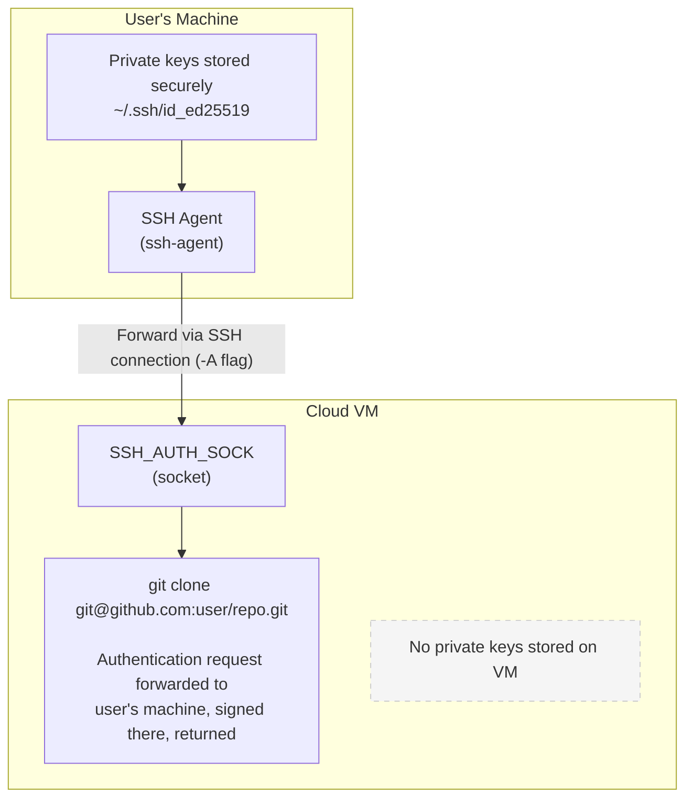

# ADR-0004: SSH Agent Forwarding for Git Access

## Status

Accepted

## Date

2025-01

## Context

Users need to clone private repositories on the cloud VM:

```bash
# On the cloud VM
git clone git@github.com:user/private-repo.git
```

This requires SSH authentication with GitHub/GitLab/Bitbucket. We need a way to provide the VM with access to private repositories.

### Requirements

- Clone private repos via SSH URLs
- No copying of private keys to the VM
- Work with existing SSH key setup
- Support multiple git hosts (GitHub, GitLab, Bitbucket)
- Minimal configuration for users

### Security Constraints

- Private keys should **never** leave the user's machine
- VM compromise should not expose keys
- Ephemeral VMs shouldn't store persistent credentials

## Decision

We will use **SSH agent forwarding** (`ssh -A`) to provide git SSH access on VMs.

### How It Works



### Implementation

1. Connect with `-A` flag:

   ```rust
   Command::new("ssh")
       .arg("-A")  // Enable agent forwarding
       .args(["-o", "StrictHostKeyChecking=accept-new"])
       .arg(format!("{}@{}", config.ssh_user, host))
       .status()
   ```

2. Pre-authorize git hosts in cloud-init:

   ```yaml
   write_files:
     - path: /home/dev/.ssh/config
       content: |
         Host github.com gitlab.com bitbucket.org
           StrictHostKeyChecking accept-new
   ```

3. Add host keys to known_hosts:

   ```bash
   ssh-keyscan github.com gitlab.com >> ~/.ssh/known_hosts
   ```

## Consequences

### Positive

- **Keys never leave local machine**: Maximum security
- **No configuration needed**: Works with existing SSH setup
- **Transparent**: `git clone` just works
- **Temporary access**: Forwarding ends when SSH disconnects
- **Multi-host support**: Works with any SSH-based git host

### Negative

- **Requires ssh-agent**: User must have agent running
- **Connection-dependent**: Only works while connected
- **Risk if VM compromised**: Attacker could use forwarded agent while connected
- **Passphrase handling**: User must unlock keys before connecting

### Neutral

- Only works for SSH URLs, not HTTPS
- Requires user to understand SSH keys

## Security Considerations

### Risk: Malicious Process on VM

A root process on the VM could use the forwarded agent while the connection is active.

**Mitigations:**

- VMs are ephemeral (limited exposure window)
- User controls when to connect
- Agent forwarding only active during SSH session
- Can use `ssh-add -c` for confirmation on each use

### Risk: Leaked Agent Socket

The `SSH_AUTH_SOCK` file could be accessed by other users.

**Mitigations:**

- VM has single user (dev)
- Socket permissions restrict access
- Ephemeral VM limits exposure

### Recommendation

For highly sensitive keys, users can:

1. Use a separate key for development
2. Use `ssh-add -c` for confirmation prompts
3. Limit agent forwarding duration

## Alternatives Considered

### Alternative 1: Copy SSH Keys to VM

Upload user's SSH keys to the VM.

**Pros:**

- Works without agent
- Works even when disconnected

**Cons:**

- **Private keys on VM** - Major security risk
- Keys could be extracted if VM compromised
- Requires secure key transfer

**Why rejected:** Unacceptable security risk.

### Alternative 2: Deploy Keys

Create per-repository deploy keys.

**Pros:**

- Limited scope (single repo)
- No forwarding needed

**Cons:**

- Must create key for each repo
- Management overhead
- Doesn't scale

**Why rejected:** Too much manual work for users.

### Alternative 3: Personal Access Tokens

Use HTTPS URLs with PATs.

**Pros:**

- No SSH key management
- Works with HTTPS

**Cons:**

- Tokens stored on VM
- Must convert SSH URLs to HTTPS
- Token management complexity

**Why rejected:** Tokens on VM is still a secret exposure risk.

### Alternative 4: Git Credential Helper

Use a credential helper that prompts for authentication.

**Pros:**

- Standard git mechanism

**Cons:**

- Requires interaction for each repo
- Complex to set up

**Why rejected:** Not transparent enough.

## References

- [SSH Agent Forwarding](https://www.ssh.com/academy/ssh/agent#agent-forwarding)
- [GitHub SSH Agent Forwarding](https://docs.github.com/en/authentication/connecting-to-github-with-ssh/using-ssh-agent-forwarding)
- [Security of SSH Agent Forwarding](https://security.stackexchange.com/questions/101783/are-there-any-risks-associated-with-ssh-agent-forwarding)
