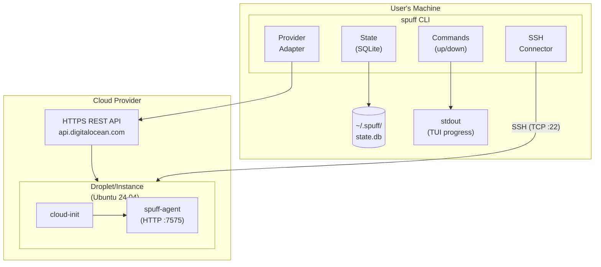
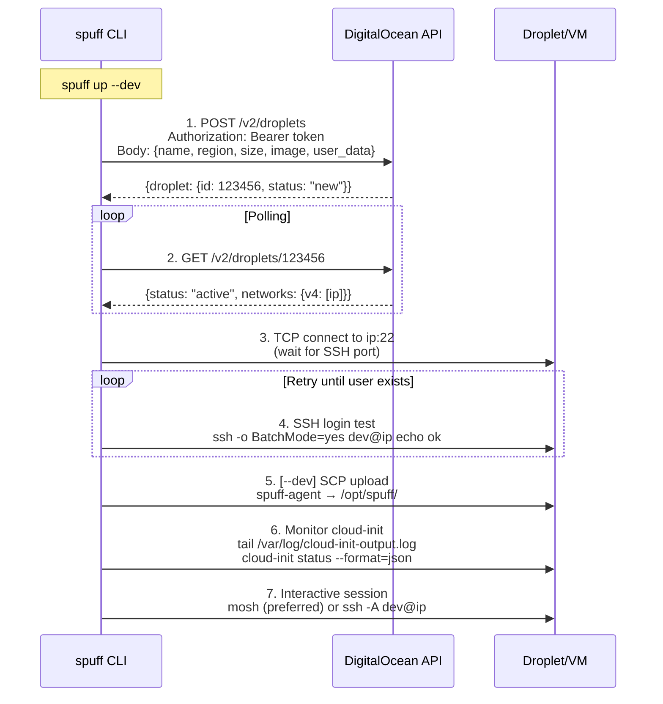
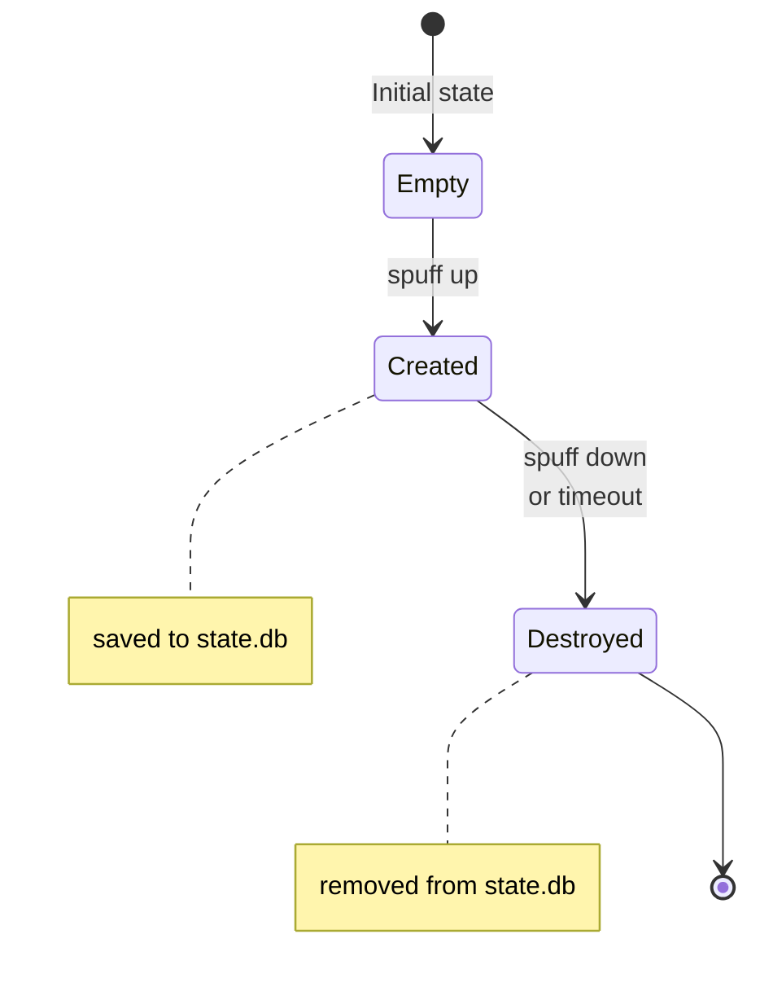
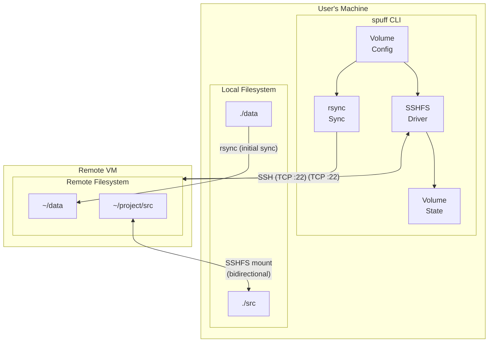
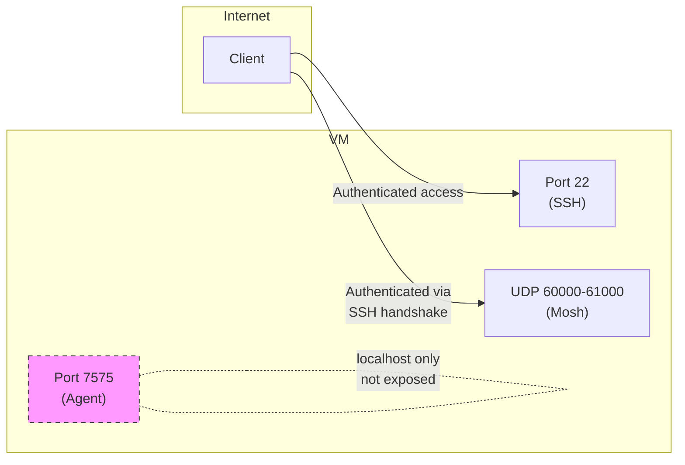

# Spuff Technical Architecture

This document provides a deep dive into spuff's architecture, protocols, data flows, and internal workings. It is intended for engineers who want to understand or contribute to the project.

## Table of Contents

- [System Overview](#system-overview)
- [Components](#components)
- [Protocol Stack](#protocol-stack)
- [Data Flow](#data-flow)
- [Cloud Provider Integration](#cloud-provider-integration)
- [SSH/Mosh/SCP Communication](#sshmoshscp-communication)
- [Agent HTTP API](#agent-http-api)
- [Cloud-Init Provisioning](#cloud-init-provisioning)
- [State Management](#state-management)
- [Volume Management](#volume-management)
- [Security Model](#security-model)

---

## System Overview

Spuff is a CLI tool that orchestrates ephemeral development VMs across cloud providers. The system consists of three main runtime components:



---

## Components

### CLI (`spuff`)

The main binary that users interact with. Built with:

- **clap** for argument parsing
- **tokio** for async runtime
- **ratatui** for terminal UI
- **reqwest** for HTTP client (provider APIs)
- **rusqlite** for local state

Key modules:

- `src/cli/commands/` - Command implementations (up, down, ssh, status, volume, etc.)
- `src/provider/` - Cloud provider abstraction layer:
  - `mod.rs` - Provider trait and common types (`ProviderInstance`, `InstanceStatus`, `Snapshot`)
  - `config.rs` - Provider-agnostic configuration (`InstanceRequest`, `ImageSpec`, `ProviderTimeouts`, `ProviderType`)
  - `error.rs` - Structured error types (`ProviderError`, `ProviderResult`)
  - `registry.rs` - Provider factory registry (`ProviderFactory`, `ProviderRegistry`)
  - `digitalocean.rs` - DigitalOcean implementation
- `src/connector/ssh.rs` - SSH/SCP operations
- `src/environment/cloud_init.rs` - Cloud-init template generation
- `src/state.rs` - SQLite state management (`LocalInstance`, `StateDb`)
- `src/volume/` - SSHFS-based volume mounting:
  - `config.rs` - Volume configuration and path resolution
  - `drivers/sshfs.rs` - SSHFS mount/unmount operations
  - `state.rs` - Local mount state tracking
- `src/tui/` - Terminal UI components

### Agent (`spuff-agent`)

A lightweight daemon running on the VM that provides:

- System metrics collection (CPU, memory, disk)
- Idle time tracking for auto-destruction
- Bootstrap status reporting
- Remote command execution (experimental)

Built with:

- **axum** for HTTP server
- **sysinfo** for system metrics
- **tokio** for async runtime

Key modules:

- `src/agent/main.rs` - Entry point and server setup
- `src/agent/routes.rs` - HTTP API endpoints
- `src/agent/metrics.rs` - System metrics collection

### Cloud-Init

YAML configuration that bootstraps the VM:

- User creation and SSH key injection
- Package installation
- Tool installation (Docker, devbox, etc.)
- Agent installation and startup

Generated from Tera templates in `src/environment/cloud_init.rs`.

---

## Protocol Stack

Spuff uses three distinct communication protocols:

| Protocol | Use Case | Port | Encryption |
|----------|----------|------|------------|
| HTTPS | Cloud Provider API | 443 | TLS 1.2+ |
| SSH | Remote shell & SCP | 22 | SSH protocol |
| Mosh | Interactive shell (preferred) | UDP 60000-61000 | AES-128 |
| HTTP | Agent API | 7575 | None (localhost) |

### Protocol Flow Diagram



---

## Data Flow

### Instance Creation (`spuff up`)

```rust
// Simplified flow from src/cli/commands/up.rs

async fn provision_instance(config: &AppConfig, ...) -> Result<()> {
    // 1. Generate cloud-init YAML from template
    let user_data = generate_cloud_init(config)?;  // Base64-encoded YAML

    // 2. Build provider-agnostic instance request
    let request = InstanceRequest::new(instance_name, config.region, config.size)
        .with_image(ImageSpec::ubuntu("24.04"))  // Provider-agnostic image spec
        .with_user_data(user_data)
        .with_label("spuff", "true")
        .with_label("managed-by", "spuff-cli");

    // 3. Call provider API to create instance (returns ProviderInstance)
    let instance = provider.create_instance(&request).await?;

    // 4. Poll until instance has public IP
    let instance = provider.wait_ready(&instance.id).await?;

    // 5. Convert ProviderInstance to LocalInstance and save to state
    let local_instance = LocalInstance::from_provider(
        &instance, instance_name, config.provider, region, size
    );
    db.save_instance(&local_instance)?;

    // 6. Wait for SSH port
    wait_for_ssh(&instance.ip, 22, timeout).await?;

    // 7. Wait for user to exist (cloud-init creates it)
    wait_for_ssh_login(&instance.ip, config, timeout).await?;

    // 8. [dev mode] Upload local agent binary
    scp_upload(&instance.ip, config, "target/release/spuff-agent", "/tmp/spuff-agent").await?;
    run_command(&instance.ip, config, "sudo mv /tmp/spuff-agent /opt/spuff/").await?;

    // 9. Monitor cloud-init progress via SSH
    wait_for_cloud_init_with_progress(&instance.ip, config, &tx).await?;

    // 10. Start interactive SSH session
    connect(&instance.ip, config).await?;
}
```

### Instance Destruction (`spuff down`)

```rust
async fn execute(config: &AppConfig) -> Result<()> {
    let db = StateDb::open()?;

    // 1. Get active instance from local state
    let instance = db.get_active_instance()?;

    // 2. Call provider API to destroy
    provider.destroy_instance(&instance.id).await?;

    // 3. Remove from local state
    db.delete_instance(&instance.id)?;
}
```

---

## Cloud Provider Integration

### DigitalOcean API

Located in `src/provider/digitalocean.rs`.

**Base URL:** `https://api.digitalocean.com/v2`

**Authentication:**

```http
Authorization: Bearer <DIGITALOCEAN_TOKEN>
```

**Endpoints Used:**

| Method | Endpoint | Purpose |
|--------|----------|---------|
| POST | `/droplets` | Create instance |
| GET | `/droplets/{id}` | Get instance status |
| DELETE | `/droplets/{id}` | Destroy instance |
| GET | `/droplets?tag_name=spuff` | List spuff instances |
| GET | `/account/keys` | Get SSH key IDs |
| POST | `/droplets/{id}/actions` | Create snapshot |
| GET | `/snapshots?resource_type=droplet` | List snapshots |
| DELETE | `/snapshots/{id}` | Delete snapshot |
| GET | `/actions/{id}` | Poll action status |

**Create Droplet Request:**

```json
{
  "name": "spuff-a1b2c3d4",
  "region": "nyc1",
  "size": "s-2vcpu-4gb",
  "image": "ubuntu-24-04-x64",
  "ssh_keys": ["12345", "67890"],
  "user_data": "<base64-encoded cloud-init>",
  "tags": ["spuff"],
  "monitoring": true
}
```

**Create Droplet Response:**

```json
{
  "droplet": {
    "id": 123456789,
    "status": "new",
    "created_at": "2024-01-01T00:00:00Z",
    "networks": { "v4": [] }
  }
}
```

**Instance Status Polling:**
The CLI polls `GET /droplets/{id}` every 5 seconds until:

- `status` changes from `"new"` to `"active"`
- `networks.v4` contains a public IP address

---

## SSH/Mosh/SCP Communication

Located in `src/connector/ssh.rs`.

### Mosh Support

Spuff automatically uses **mosh** (Mobile Shell) for interactive connections when available locally. Mosh provides:

- Better responsiveness over high-latency connections
- Seamless roaming between networks
- Connection resilience (survives sleep/wake, network changes)

**How it works:**

1. CLI checks if `mosh` is installed locally (`which mosh`)
2. If available, uses mosh for interactive sessions
3. Falls back to SSH if mosh is not installed locally

The remote server always has mosh-server installed via cloud-init.

```bash
# Mosh connection (automatic when mosh is available)
mosh --ssh="ssh -A -o StrictHostKeyChecking=accept-new -o UserKnownHostsFile=/dev/null -o LogLevel=ERROR -i ~/.ssh/id_ed25519" dev@<ip>
```

**Note:** Non-interactive operations (SCP, remote commands) always use SSH regardless of mosh availability.

### SSH Operations

All SSH operations use the system's `ssh` and `scp` binaries with consistent options:

```bash
# Common options for all SSH/SCP commands
-o StrictHostKeyChecking=accept-new   # Auto-accept new host keys
-o UserKnownHostsFile=/dev/null       # Don't persist host keys
-o LogLevel=ERROR                      # Suppress warnings
-o BatchMode=yes                       # Non-interactive mode
-i ~/.ssh/id_ed25519                  # Private key path
```

### SSH Functions

**wait_for_ssh(host, port, timeout)**

```rust
// TCP connection test (no SSH handshake)
// Used to detect when SSH port opens
loop {
    match TcpStream::connect(&addr).await {
        Ok(_) => break,  // Port is open
        Err(_) => sleep(2s).await,
    }
}
```

**wait_for_ssh_login(host, config, timeout)**

```rust
// Full SSH login test (waits for user to exist)
loop {
    let result = Command::new("ssh")
        .args(["-o", "BatchMode=yes", ...])
        .arg(format!("{}@{}", config.ssh_user, host))
        .arg("echo ok")
        .output().await;

    if result.status.success() {
        return Ok(());
    }
    sleep(3s).await;
}
```

**run_command(host, config, command)**

```rust
// Execute remote command and capture output
Command::new("ssh")
    .args([...common_options...])
    .arg(format!("{}@{}", config.ssh_user, host))
    .arg(command)
    .output().await
```

**scp_upload(host, config, local_path, remote_path)**

```rust
// Upload file via SCP
Command::new("scp")
    .args([...common_options...])
    .arg(local_path)
    .arg(format!("{}@{}:{}", config.ssh_user, host, remote_path))
    .output().await
```

**connect(host, config)**

```rust
// Prefers mosh if available locally, falls back to SSH
if is_mosh_available() {
    // Mosh connection with SSH options
    Command::new("mosh")
        .arg("--ssh")
        .arg("ssh -A -o StrictHostKeyChecking=accept-new ...")
        .arg(format!("{}@{}", config.ssh_user, host))
        .status().await
} else {
    // Fallback: Interactive SSH session with agent forwarding
    Command::new("ssh")
        .arg("-A")  // Forward SSH agent for git
        .args([...common_options...])
        .arg(format!("{}@{}", config.ssh_user, host))
        .stdin(Stdio::inherit())
        .stdout(Stdio::inherit())
        .stderr(Stdio::inherit())
        .status().await
}
```

### SSH Agent Forwarding

The `-A` flag enables SSH agent forwarding, allowing:

- Git operations with SSH URLs on the VM
- Access to private repositories without copying keys
- Chain SSH connections through the VM

---

## Agent HTTP API

Located in `src/agent/routes.rs`.

**Server:** Axum on `127.0.0.1:7575` (localhost only)

**Authentication:**

```http
X-Spuff-Token: <SPUFF_AGENT_TOKEN>
```

If `SPUFF_AGENT_TOKEN` env var is not set, authentication is disabled.

### Endpoints

#### GET /health (public)

```json
{
  "status": "ok",
  "service": "spuff-agent",
  "version": "0.1.0"
}
```

#### GET /status (authenticated)

```json
{
  "uptime_seconds": 3600,
  "idle_seconds": 120,
  "hostname": "spuff-a1b2c3d4",
  "cloud_init_done": true,
  "bootstrap_status": "ready",
  "bootstrap_ready": true,
  "agent_version": "0.1.0"
}
```

Bootstrap status values:

- `"unknown"` - Status file doesn't exist
- `"running"` - Bootstrap in progress
- `"ready"` - Bootstrap complete
- `"failed"` - Bootstrap encountered errors

#### GET /metrics (authenticated)

```json
{
  "cpu_usage_percent": 25.5,
  "memory_used_bytes": 1073741824,
  "memory_total_bytes": 4294967296,
  "disk_used_bytes": 5368709120,
  "disk_total_bytes": 85899345920,
  "load_average": [0.5, 0.3, 0.2],
  "timestamp": "2024-01-01T00:00:00Z"
}
```

#### GET /processes (authenticated)

Returns top 10 processes by CPU usage.

#### POST /exec (authenticated, experimental)

```json
// Request
{
  "command": "ls -la /home",
  "timeout_secs": 30
}

// Response
{
  "exit_code": 0,
  "stdout": "...",
  "stderr": "",
  "duration_ms": 15
}
```

#### POST /heartbeat (authenticated)

Resets idle timer. Returns current timestamp.

#### GET /logs?file=/var/log/syslog&lines=100 (authenticated)

Returns last N lines from log files in `/var/log/`.

#### GET /cloud-init (authenticated)

```json
{
  "status": "done",
  "done": true,
  "errors": [],
  "boot_finished": "2024-01-01T00:05:00Z"
}
```

---

## Cloud-Init Provisioning

### Template Structure

Cloud-init YAML is generated from Tera templates in `src/environment/cloud_init.rs`.

```yaml
#cloud-config

# User creation
users:
  - name: {{ username }}
    groups: [sudo, docker]
    shell: /bin/bash
    sudo: ["ALL=(ALL) NOPASSWD:ALL"]
    lock_passwd: true
    ssh_authorized_keys:
      - {{ ssh_public_key }}

# Disable root login
disable_root: true
ssh_pwauth: false

# Package management
package_update: true
package_upgrade: false
packages:
  - git
  - curl
  - vim
  - htop
  - unzip
  - build-essential

# File creation
write_files:
  # Sync bootstrap script (runs during cloud-init)
  - path: /opt/spuff/bootstrap-sync.sh
    permissions: "0755"
    content: |
      #!/bin/bash
      # Docker, basic tools, etc.

  # Async bootstrap script (runs in background)
  - path: /opt/spuff/bootstrap-async.sh
    permissions: "0755"
    content: |
      #!/bin/bash
      # devbox, node.js, claude-code, etc.

  # systemd service for agent
  - path: /etc/systemd/system/spuff-agent.service
    content: |
      [Unit]
      Description=Spuff Agent
      After=network.target

      [Service]
      Type=simple
      ExecStart=/opt/spuff/spuff-agent
      Environment=SPUFF_AGENT_TOKEN={{ agent_token }}
      Restart=always

      [Install]
      WantedBy=multi-user.target

  # Shell configuration (.bashrc)
  - path: {{ home_dir }}/.bashrc
    content: |
      # Aliases
      alias ll='eza -la'
      alias g='git'
      # ...

# Command execution
runcmd:
  - ["/opt/spuff/bootstrap-sync.sh"]
  - ["systemctl", "daemon-reload"]
  - ["systemctl", "enable", "spuff-agent"]
  - ["nohup", "/opt/spuff/bootstrap-async.sh", "&"]
```

### Two-Phase Bootstrap

To minimize time to first SSH login, bootstrap is split into two phases:

**Phase 1: Synchronous (bootstrap-sync.sh)**

- Runs during cloud-init
- Installs critical components:
  - Docker
  - Basic shell tools (fzf, bat, eza)
  - Creates directory structure
- SSH login is blocked until this completes

**Phase 2: Asynchronous (bootstrap-async.sh)**

- Runs in background via `nohup`
- Installs heavier components:
  - devbox/nix
  - Node.js
  - Claude Code CLI
  - spuff-agent download
  - Dotfiles clone
- Progress tracked via `/opt/spuff/bootstrap.status`

### Status File

The async bootstrap writes its status to `/opt/spuff/bootstrap.status`:

```bash
# During bootstrap
echo "running" > /opt/spuff/bootstrap.status

# On completion
echo "ready" > /opt/spuff/bootstrap.status

# On error
echo "failed" > /opt/spuff/bootstrap.status
```

This file is read by the agent's `/status` endpoint.

---

## State Management

Located in `src/state.rs`.

**Database:** SQLite at `~/.spuff/state.db`

### Schema

```sql
CREATE TABLE IF NOT EXISTS instances (
    id TEXT PRIMARY KEY,
    name TEXT NOT NULL,
    ip TEXT NOT NULL,
    provider TEXT NOT NULL,
    region TEXT NOT NULL,
    size TEXT NOT NULL,
    created_at TEXT NOT NULL,
    active INTEGER DEFAULT 1
);
```

### Types

**LocalInstance** - Instance information stored locally (different from `ProviderInstance` which represents the provider's view):

```rust
pub struct LocalInstance {
    pub id: String,        // Provider-specific instance ID
    pub name: String,      // Human-readable instance name
    pub ip: String,        // Public IP address (as string for storage)
    pub provider: String,  // Which cloud provider manages this instance
    pub region: String,    // Region/datacenter where the instance runs
    pub size: String,      // Instance size/type
    pub created_at: DateTime<Utc>,
}

impl LocalInstance {
    // Create from a ProviderInstance (returned by provider API)
    pub fn from_provider(
        provider_instance: &ProviderInstance,
        name: String,
        provider: String,
        region: String,
        size: String,
    ) -> Self;
}
```

### Operations

```rust
impl StateDb {
    pub fn open() -> Result<Self>;

    pub fn save_instance(&self, instance: &LocalInstance) -> Result<()>;
    pub fn get_active_instance(&self) -> Result<Option<LocalInstance>>;
    pub fn remove_instance(&self, id: &str) -> Result<()>;
    pub fn list_instances(&self) -> Result<Vec<LocalInstance>>;
    pub fn update_instance_ip(&self, id: &str, ip: &str) -> Result<()>;
}
```

### Instance Lifecycle



---

## Volume Management

Located in `src/volume/`.

Spuff provides SSHFS-based volume mounting for bidirectional file synchronization between local machine and remote VM.

### Architecture



### Components

**VolumeConfig** (`src/volume/config.rs`)

Handles volume configuration parsing and path resolution:

```rust
pub struct VolumeConfig {
    pub source: String,        // Local directory path
    pub target: String,        // Remote directory path on VM
    pub mount_point: Option<String>, // Where to mount locally (optional)
}

impl VolumeConfig {
    // Resolve source path relative to spuff.yaml location
    pub fn resolve_source(&self, base_dir: Option<&str>) -> String;

    // Resolve mount point with fallback logic:
    // 1. Explicit mount_point if set
    // 2. source path for bidirectional editing
    // 3. Auto-generate under ~/.local/share/spuff/mounts/
    pub fn resolve_mount_point(&self, instance_name: Option<&str>, base_dir: Option<&str>) -> String;
}
```

**SshfsDriver** (`src/volume/drivers/sshfs.rs`)

Manages SSHFS mount/unmount operations:

```rust
pub struct SshfsDriver {
    ssh_user: String,
    ssh_host: String,
    ssh_key_path: String,
}

impl SshfsDriver {
    // Mount remote directory locally via SSHFS
    pub async fn mount(&self, remote_path: &str, local_path: &str) -> Result<()>;

    // Ensure remote directory exists (creates if needed)
    pub async fn ensure_remote_dir_exists(&self, remote_path: &str) -> Result<()>;
}

pub struct SshfsLocalCommands;

impl SshfsLocalCommands {
    // Check if a path is currently mounted
    pub async fn is_mounted(mount_point: &str) -> Result<bool>;

    // Unmount with force options for platform-specific handling
    pub async fn unmount(mount_point: &str) -> Result<()>;
}
```

**VolumeState** (`src/volume/state.rs`)

Tracks mounted volumes locally:

```rust
pub struct VolumeState {
    pub mounts: Vec<MountInfo>,
}

pub struct MountInfo {
    pub mount_point: String,
    pub remote_path: String,
    pub instance_name: String,
    pub mounted_at: DateTime<Utc>,
}
```

### Data Flow

**Mount Flow (`spuff up` / `spuff volume mount`):**

```
1. Load volume configuration from spuff.yaml
2. For each volume:
   a. Resolve source path (relative to spuff.yaml)
   b. Resolve mount point (source path for bidirectional, or auto-generate)
   c. Create remote directory on VM via SSH
   d. rsync local source → remote target (initial sync)
   e. Mount remote target → local mount_point via SSHFS
   f. Track mount in VolumeState
```

**Unmount Flow (`spuff down` / `spuff volume unmount`):**

```
1. Load VolumeState and project config
2. Collect all mount points to unmount
3. For each mount point:
   a. Try standard unmount (umount / fusermount -u)
   b. If fails, try force unmount:
      - macOS: umount -f, then diskutil unmount force
      - Linux: fusermount -uz, then umount -l
   c. Remove from VolumeState
4. Proceed with VM destruction (if spuff down)
```

### Platform-Specific Handling

**macOS:**
- Requires macFUSE installation
- Force unmount sequence: `umount -f` → `diskutil unmount force`
- SSHFS installed via Homebrew: `brew install macfuse sshfs`

**Linux:**
- Uses native FUSE support
- Force unmount sequence: `fusermount -uz` → `umount -l` (lazy unmount)
- SSHFS installed via package manager: `apt install sshfs`

### SSH Wrapper for Paths with Spaces

SSHFS requires special handling for SSH key paths containing spaces. The driver creates a temporary wrapper script:

```bash
#!/bin/bash
exec ssh -i "/path/with spaces/key" -o StrictHostKeyChecking=accept-new "$@"
```

This wrapper is passed to SSHFS via the `-o ssh_command=` option.

---

## Security Model

### Authentication Layers

1. **Cloud Provider API**
   - Bearer token authentication
   - Token stored in env var or config file
   - Config file permissions: `0600`

2. **SSH**
   - Ed25519 key pair (or RSA)
   - Public key registered with provider
   - Private key protected by filesystem permissions
   - Optional passphrase (requires ssh-agent)

3. **Agent API**
   - Token-based authentication via `X-Spuff-Token` header
   - Server binds to localhost only (127.0.0.1)
   - Token passed via env var to agent service

### Network Security



### VM Security Hardening

From cloud-init:

- Root SSH login disabled (`disable_root: true`)
- Password authentication disabled (`ssh_pwauth: false`)
- User password locked (`lock_passwd: true`)
- Non-root user with sudo access
- Only SSH key authentication allowed

### Sensitive Data Handling

| Data | Storage | Protection |
|------|---------|------------|
| API Token | env var or config.yaml | File permissions (0600) |
| SSH Private Key | ~/.ssh/id_* | File permissions (0600) |
| Agent Token | env var | Process environment |
| State DB | ~/.spuff/state.db | File permissions |

---

## Error Handling

### Structured Provider Errors

Provider operations use structured `ProviderError` types for proper error handling and recovery strategies:

```rust
pub enum ProviderError {
    // Authentication issues - token invalid, expired, etc.
    Authentication { provider: String, message: String },

    // Rate limiting - includes optional retry-after duration
    RateLimit { retry_after: Option<Duration> },

    // Resource not found - instance, snapshot, etc.
    NotFound { resource_type: String, id: String },

    // Quota exceeded - droplet limit, snapshot limit, etc.
    QuotaExceeded { resource: String, message: String },

    // Operation timeout with elapsed time
    Timeout { operation: String, elapsed: Duration },

    // Generic API error with HTTP status
    Api { status: u16, message: String },
}

// Check if error is retryable
impl ProviderError {
    pub fn is_retryable(&self) -> bool {
        matches!(self, Self::RateLimit { .. } | Self::Timeout { .. } | Self::Network(_))
    }

    pub fn retry_after(&self) -> Option<Duration> {
        match self {
            Self::RateLimit { retry_after } => *retry_after,
            Self::Timeout { .. } => Some(Duration::from_secs(5)),
            Self::Network(_) => Some(Duration::from_secs(2)),
            _ => None,
        }
    }
}
```

### SSH Errors

The system provides clear error messages for common SSH issues:

```rust
// Key requires passphrase but ssh-agent not running
if stderr.contains("Permission denied") || stderr.contains("passphrase") {
    return Err(SpuffError::Ssh(
        "SSH key requires passphrase. Run 'ssh-add' first."
    ));
}
```

### Provider API Errors

Provider API calls use structured errors that can be matched for specific handling:

```rust
match provider.create_instance(&request).await {
    Ok(instance) => { /* success */ },
    Err(ProviderError::Authentication { .. }) => {
        // Invalid token - prompt user to check credentials
    },
    Err(ProviderError::QuotaExceeded { resource, .. }) => {
        // Quota reached - suggest cleanup or upgrade
    },
    Err(ProviderError::RateLimit { retry_after }) => {
        // Rate limited - wait and retry
        if let Some(duration) = retry_after {
            tokio::time::sleep(duration).await;
        }
    },
    Err(e) => {
        // Other errors - propagate
        return Err(e.into());
    }
}
```

### Timeout Handling

Operations have configurable timeouts:

| Operation | Default Timeout |
|-----------|-----------------|
| Provider API calls | 30s |
| SSH port wait | 300s (5 min) |
| SSH login wait | 120s (2 min) |
| Cloud-init wait | 600s (10 min) |
| Agent exec command | 30s |

---

## Extending Spuff

### Adding a New Provider

Spuff uses a **Registry Pattern** for providers, making it easy to add new cloud providers without modifying existing code.

#### Step 1: Create Provider Module

Create `src/provider/<name>.rs` (e.g., `src/provider/hetzner.rs`).

#### Step 2: Implement the Provider Trait

```rust
use async_trait::async_trait;
use crate::provider::{
    ImageSpec, InstanceRequest, Provider, ProviderInstance,
    ProviderResult, ProviderTimeouts, Snapshot,
};

pub struct HetznerProvider {
    client: reqwest::Client,
    token: String,
    timeouts: ProviderTimeouts,
}

#[async_trait]
impl Provider for HetznerProvider {
    fn name(&self) -> &'static str {
        "hetzner"
    }

    async fn create_instance(&self, request: &InstanceRequest) -> ProviderResult<ProviderInstance> {
        // Convert ImageSpec to Hetzner image ID
        let image = self.resolve_image(&request.image)?;
        // Call Hetzner API...
    }

    async fn destroy_instance(&self, id: &str) -> ProviderResult<()> { ... }
    async fn get_instance(&self, id: &str) -> ProviderResult<Option<ProviderInstance>> { ... }
    async fn list_instances(&self) -> ProviderResult<Vec<ProviderInstance>> { ... }
    async fn wait_ready(&self, id: &str) -> ProviderResult<ProviderInstance> { ... }
    async fn create_snapshot(&self, instance_id: &str, name: &str) -> ProviderResult<Snapshot> { ... }
    async fn list_snapshots(&self) -> ProviderResult<Vec<Snapshot>> { ... }
    async fn delete_snapshot(&self, id: &str) -> ProviderResult<()> { ... }
}
```

#### Step 3: Implement the ProviderFactory Trait

```rust
use crate::provider::{
    ProviderFactory, ProviderResult, ProviderTimeouts, ProviderType,
};

pub struct HetznerFactory;

impl ProviderFactory for HetznerFactory {
    fn provider_type(&self) -> ProviderType {
        ProviderType::Hetzner
    }

    fn create(&self, token: &str, timeouts: ProviderTimeouts) -> ProviderResult<Box<dyn Provider>> {
        if token.is_empty() {
            return Err(ProviderError::auth("hetzner", "API token is required"));
        }
        Ok(Box::new(HetznerProvider::new(token, timeouts)?))
    }
}
```

#### Step 4: Register the Provider

In `src/provider/registry.rs`, add your factory to the default registration:

```rust
pub fn register_defaults(&mut self) {
    use super::digitalocean::DigitalOceanFactory;
    use super::hetzner::HetznerFactory;  // Add this

    self.register(DigitalOceanFactory);
    self.register(HetznerFactory);  // Add this
}
```

#### Step 5: Add Provider Type

In `src/provider/config.rs`, add your provider to the enum:

```rust
#[derive(Debug, Clone, Copy, PartialEq, Eq, Hash)]
pub enum ProviderType {
    DigitalOcean,
    Hetzner,  // Add this
    Aws,
    // ...
}

impl ProviderType {
    pub fn from_str(s: &str) -> Option<Self> {
        match s.to_lowercase().as_str() {
            "digitalocean" | "do" => Some(Self::DigitalOcean),
            "hetzner" => Some(Self::Hetzner),  // Add this
            // ...
        }
    }

    pub fn is_implemented(&self) -> bool {
        matches!(self, Self::DigitalOcean | Self::Hetzner)  // Add here
    }
}
```

### Key Types for Provider Implementation

**InstanceRequest** - Provider-agnostic instance configuration:

```rust
pub struct InstanceRequest {
    pub name: String,
    pub region: String,
    pub size: String,
    pub image: ImageSpec,
    pub user_data: Option<String>,
    pub labels: HashMap<String, String>,
}
```

**ImageSpec** - Provider-agnostic image specification:

```rust
pub enum ImageSpec {
    Ubuntu(String),    // e.g., "24.04"
    Debian(String),    // e.g., "12"
    Custom(String),    // Provider-specific image ID
    Snapshot(String),  // Snapshot ID
}
```

**ProviderInstance** - Instance returned by provider operations:

```rust
pub struct ProviderInstance {
    pub id: String,
    pub ip: IpAddr,
    pub status: InstanceStatus,
    pub created_at: DateTime<Utc>,
}
```

**ProviderError** - Structured error types for proper handling:

```rust
pub enum ProviderError {
    Authentication { provider: String, message: String },
    RateLimit { retry_after: Option<Duration> },
    NotFound { resource_type: String, id: String },
    QuotaExceeded { resource: String, message: String },
    Timeout { operation: String, elapsed: Duration },
    Api { status: u16, message: String },
    // ...
}
```

### Adding Agent Endpoints

1. Add route in `src/agent/routes.rs`:

```rust
pub fn create_routes() -> Router<Arc<AppState>> {
    Router::new()
        // ... existing routes ...
        .route("/custom", get(custom_endpoint))
}

async fn custom_endpoint(
    AuthenticatedState(state): AuthenticatedState,
) -> impl IntoResponse {
    state.update_activity().await;
    Json(serde_json::json!({ "custom": "data" }))
}
```

---

## Debugging

### Enable Debug Logging

```bash
RUST_LOG=debug spuff up
```

### Inspect Cloud-Init

```bash
# On the VM
sudo cat /var/log/cloud-init-output.log
sudo cloud-init status --format=json
cat /opt/spuff/bootstrap.status
```

### Agent Status

```bash
# On the VM
sudo systemctl status spuff-agent
sudo journalctl -u spuff-agent -f
curl -H "X-Spuff-Token: $TOKEN" http://127.0.0.1:7575/status
```

### Local State

```bash
sqlite3 ~/.spuff/state.db "SELECT * FROM instances;"
```
