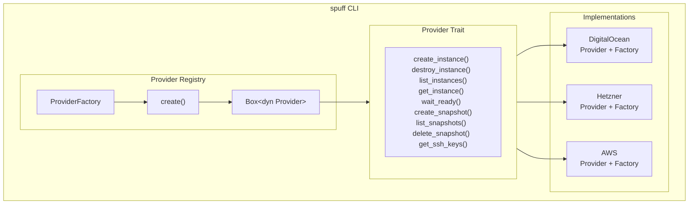

# Provider System

Spuff uses a provider abstraction layer that enables support for multiple cloud providers. This document explains how the system works.

## Overview



## Architecture

The provider system follows the **Registry Pattern**, which enables:

1. **Extensibility**: Add new providers without modifying existing code
2. **Dynamic discovery**: List available providers at runtime
3. **Uniform configuration**: All providers use the same creation interface

### Main Components

| File | Responsibility |
|------|----------------|
| `src/provider/mod.rs` | `Provider` trait and core types |
| `src/provider/registry.rs` | `ProviderFactory` and `ProviderRegistry` |
| `src/provider/config.rs` | `InstanceRequest`, `ImageSpec`, `ProviderTimeouts` |
| `src/provider/error.rs` | `ProviderError` with specific types |
| `src/provider/digitalocean.rs` | Reference implementation |

### Provider Creation Flow

```rust
// 1. Registry with registered factories
let registry = ProviderRegistry::with_defaults();

// 2. Create provider by name
let provider = registry.create_by_name(
    "digitalocean",
    &api_token,
    ProviderTimeouts::default()
)?;

// 3. Use the provider
let instance = provider.create_instance(&request).await?;
```

## Core Types

### InstanceRequest

Configuration for creating an instance (provider-agnostic):

```rust
pub struct InstanceRequest {
    pub name: String,                        // Instance name
    pub region: String,                      // Region/datacenter
    pub size: String,                        // Instance type/size
    pub image: ImageSpec,                    // OS image
    pub user_data: Option<String>,           // Cloud-init script
    pub labels: HashMap<String, String>,     // Tags/labels
}
```

### ImageSpec

Provider-agnostic image specification:

```rust
pub enum ImageSpec {
    Ubuntu(String),      // e.g., "24.04" → provider maps to slug
    Debian(String),      // e.g., "12"
    Custom(String),      // Provider-specific ID
    Snapshot(String),    // Snapshot ID to restore from
}
```

### ProviderInstance

Instance returned by the provider:

```rust
pub struct ProviderInstance {
    pub id: String,                          // Provider-specific ID
    pub ip: IpAddr,                          // Public IP address
    pub status: InstanceStatus,              // Current state
    pub created_at: DateTime<Utc>,           // Timestamp
}
```

### InstanceStatus

Possible instance states:

```rust
pub enum InstanceStatus {
    New,                    // Being created
    Active,                 // Running and ready
    Off,                    // Powered off
    Archive,                // Stopped/archived
    Unknown(String),        // Provider-specific status
}
```

### ProviderError

Structured errors with retry information:

```rust
pub enum ProviderError {
    Authentication { provider: String, message: String },
    RateLimit { retry_after: Option<Duration> },
    NotFound { resource_type: String, id: String },
    QuotaExceeded { resource: String, message: String },
    InvalidConfig { field: String, message: String },
    Timeout { operation: String, elapsed: Duration },
    Api { status: u16, message: String },
    // ... others
}

// Useful helpers
error.is_retryable()      // true for RateLimit, Timeout, Network
error.retry_after()       // Duration to wait before retry
```

## Current Providers

| Provider | Status | File | Env Var |
|----------|--------|------|---------|
| DigitalOcean | Stable | `digitalocean.rs` | `DIGITALOCEAN_TOKEN` |
| Hetzner | Planned | - | `HETZNER_TOKEN` |
| AWS EC2 | Planned | - | `AWS_ACCESS_KEY_ID` |

## Documentation

- **[Creating a Provider](creating-a-provider.md)** - Complete step-by-step guide
- **[Provider API Reference](provider-api.md)** - Detailed documentation for each method
- **[Testing Providers](testing-providers.md)** - Testing strategies with mocks

## Contributing

Want to add support for a new provider? Follow these steps:

1. Open an issue to discuss the implementation
2. Read the [Creating a Provider](creating-a-provider.md) guide
3. Use the DigitalOcean implementation as reference
4. Ensure adequate test coverage
5. Update the documentation

### Design Decisions

Consult the ADR to understand architectural decisions:
- [ADR-0005: Provider Trait Abstraction](../adr/0005-provider-trait-abstraction.md)
