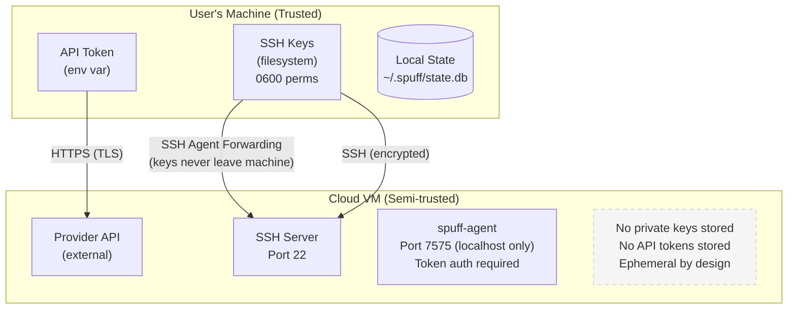

# Security Model

This document describes spuff's security architecture, threat model, and security considerations.

## Overview

Spuff handles sensitive data including:
- Cloud provider API tokens
- SSH private keys (by reference)
- Agent authentication tokens
- User data in cloud-init

The security model is designed around:
1. **Minimal exposure**: Only expose what's necessary
2. **Short-lived access**: Ephemeral VMs limit attack window
3. **No secret storage on VMs**: Keys stay local via SSH forwarding
4. **Defense in depth**: Multiple security layers

## Architecture Security



## Threat Model

### Assets to Protect

| Asset | Location | Protection |
|-------|----------|------------|
| Cloud API token | User's machine | Env var, never stored in files |
| SSH private key | User's machine | Filesystem permissions, ssh-agent |
| Agent token | VM env var | Per-session generation |
| User code | VM | Ephemeral, user responsibility |

### Threat Actors

1. **External attackers**: Internet-based attacks
2. **Compromised VM**: Malicious code on VM
3. **Man-in-the-middle**: Network interception
4. **Insider threat**: Shared machine access

### Attack Scenarios

#### Scenario 1: VM Compromise

**Threat**: Attacker gains root on VM

**Impact without mitigations**:
- Could use SSH agent to sign requests (while user connected)
- Could read any data on VM
- Could attack other systems from VM

**Mitigations**:
- SSH agent forwarding is session-scoped
- No persistent credentials on VM
- Ephemeral nature limits exposure window
- Agent binds to localhost only

#### Scenario 2: API Token Theft

**Threat**: Attacker obtains cloud API token

**Impact**:
- Could create/destroy instances
- Could access other resources in account
- Cost impact from resource creation

**Mitigations**:
- Token stored in env var, not file
- Recommended: Use scoped tokens where possible
- Regular token rotation

#### Scenario 3: Network Interception

**Threat**: MITM attack on communications

**Impact without mitigations**:
- Could intercept API calls
- Could hijack SSH sessions

**Mitigations**:
- Provider API uses TLS
- SSH provides end-to-end encryption
- Host key verification (accept-new policy)

## Security Controls

### Authentication

#### Cloud Provider API

```
Authorization: Bearer <token>
```

- Token stored in environment variable
- Never written to config files
- Transmitted over TLS only

#### SSH Access

- Ed25519 or RSA key pairs
- No password authentication
- Key-based auth only
- Agent forwarding for git operations

#### Agent API

```
X-Spuff-Token: <token>
```

- Token generated per VM creation
- Passed via systemd environment
- Required for all authenticated endpoints
- Agent binds to 127.0.0.1 only

### Network Security

#### Exposed Ports

| Port | Service | Exposure | Notes |
|------|---------|----------|-------|
| 22 | SSH | Public | Key auth only |
| 7575 | Agent | Localhost | Token auth required |

#### Firewall Recommendations

- Only allow SSH from known IPs if possible
- No other inbound ports required
- Outbound: Allow HTTPS for package updates

### VM Hardening

Cloud-init applies these hardening measures:

```yaml
# Disable root SSH login
disable_root: true

# Disable password auth
ssh_pwauth: false

# Lock user password
users:
  - name: dev
    lock_passwd: true

# Sudo without password (dev convenience)
    sudo: ["ALL=(ALL) NOPASSWD:ALL"]
```

### Data Protection

#### At Rest

| Data | Storage | Protection |
|------|---------|------------|
| Config | ~/.spuff/config.yaml | 0600 permissions |
| State | ~/.spuff/state.db | Standard file perms |
| SSH keys | ~/.ssh/ | 0600 permissions |

#### In Transit

| Channel | Protection |
|---------|------------|
| Provider API | TLS 1.2+ |
| SSH | SSH protocol encryption |
| Cloud-init | Base64 (not encryption) |

### Secrets Management

#### Do's

- Store API tokens in environment variables
- Use ssh-agent for key management
- Rotate tokens regularly
- Use scoped tokens when possible

#### Don'ts

- Never commit tokens to git
- Never store tokens in config files
- Never copy private keys to VMs
- Never disable SSH key verification

## Security Considerations

### SSH Agent Forwarding Risks

**Risk**: A root process on the VM can use the forwarded agent while you're connected.

**Mitigations**:
- Keep SSH sessions short
- Use `ssh-add -c` for confirmation prompts
- Consider separate keys for development
- VM is ephemeral, limiting exposure window

**Recommendation for sensitive operations**:
```bash
# Add key with confirmation
ssh-add -c ~/.ssh/id_ed25519

# Each use requires confirmation click
```

### Cloud-Init Secrets

**Issue**: User data is accessible on VM via metadata service.

**Mitigations**:
- Agent token is the only secret in cloud-init
- Token only valid for that VM's agent
- Agent binds to localhost

### Ephemeral Security Benefits

The ephemeral nature provides security benefits:

1. **Limited persistence**: Compromises don't persist
2. **Fresh state**: Each VM starts clean
3. **Short window**: Less time for attacks
4. **Easy recovery**: Just create new VM

## Compliance Considerations

### For Sensitive Workloads

If using spuff for sensitive work:

1. **Network isolation**: Use Tailscale or VPN
2. **Audit logging**: Enable provider audit logs
3. **Access control**: Limit who has API tokens
4. **Data handling**: Don't store sensitive data on VM

### Data Residency

- Choose regions based on data residency requirements
- Be aware that cloud-init data is stored by providers

## Incident Response

### If API Token Compromised

1. Revoke token immediately in provider dashboard
2. Check for unauthorized resources
3. Generate new token
4. Audit recent activity

### If VM Compromised

1. Destroy VM: `spuff down --force`
2. Revoke any tokens that were on VM
3. Check for unusual account activity
4. Create new VM with fresh token

### If SSH Key Compromised

1. Remove public key from provider
2. Remove from all VMs
3. Generate new key pair
4. Update configuration

## Security Checklist

### Initial Setup

- [ ] API token in environment variable, not file
- [ ] SSH key has passphrase
- [ ] SSH key added to agent
- [ ] File permissions correct (0600 for keys)

### Ongoing

- [ ] Destroy VMs when not in use
- [ ] Rotate API tokens periodically
- [ ] Review provider audit logs
- [ ] Keep spuff updated

### For Teams

- [ ] Each user has own API token
- [ ] Separate keys per user
- [ ] Document token rotation process
- [ ] Incident response plan

## Reporting Vulnerabilities

If you discover a security vulnerability:

1. **Do not** create a public issue
2. Email: security@avelino.run
3. Include:
   - Description of vulnerability
   - Steps to reproduce
   - Potential impact
4. Allow 48 hours for initial response

See [SECURITY.md](../SECURITY.md) for full policy.

## References

- [SSH Agent Forwarding Security](https://security.stackexchange.com/questions/101783/)
- [cloud-init Security](https://cloudinit.readthedocs.io/en/latest/topics/security.html)
- [DigitalOcean Security](https://www.digitalocean.com/trust/security)
